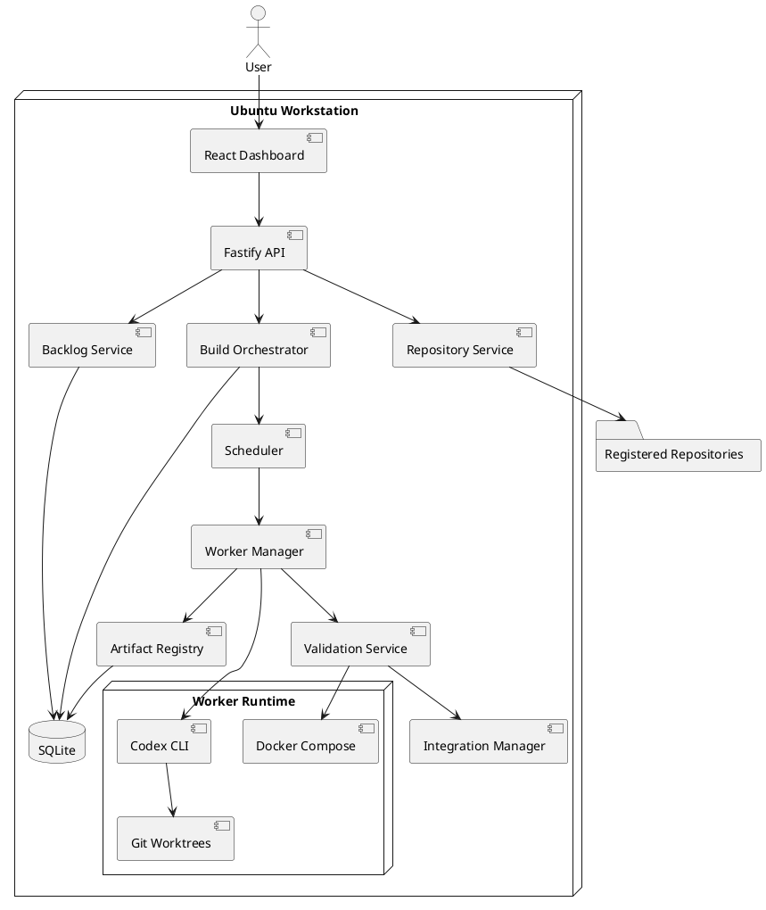
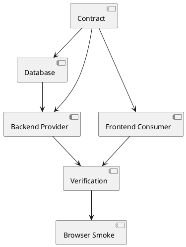

# SPEC-1-AgentFlow-Local-Agentic-Engineering-Platform

## Background

AgentFlow is a local-first engineering control plane for coordinating multiple AI development workers across registered Git repositories.

The current workflow uses Ubuntu Linux, VS Code, the Codex extension and CLI, Docker, Markdown backlogs, and a JavaScript dispatcher that evaluates task dependencies. That workflow can identify that a task such as `BL-005` must wait for both `BL-002` and `BL-007`, but dispatch, isolation, validation, handoff, integration, and recovery are inconsistent across builds.

The intended operating model is:

```text
Select an epic or backlog
        ↓
Validate dependencies and contracts
        ↓
Calculate execution waves and critical path
        ↓
Launch up to four isolated workers
        ↓
Exchange versioned artifacts between streams
        ↓
Validate and integrate completed work
        ↓
Produce one reviewable release candidate
```

The MVP is a standalone local web application bound to `127.0.0.1`. It may register multiple repositories, but only one build may be active across the platform. Each active build may run up to four Codex workers concurrently.

Cross-stream coordination uses explicit contracts, fixtures, generated types, and immutable handoff manifests instead of unstructured agent-to-agent messages.

## Requirements

### Must Have

- Register and manage multiple local Git repositories.
- Permit only one active build across the AgentFlow installation.
- Bind the web application and API to `127.0.0.1` by default.
- Read repository-specific behavior from a version-controlled `.agentflow.yaml`.
- Import and parse Markdown backlogs.
- Support unique task IDs, descriptions, acceptance criteria, estimates, dependencies, ownership paths, validation commands, consumed artifacts, and produced artifacts.
- Validate duplicate IDs, missing dependencies, dependency cycles, invalid paths, and incomplete task metadata before starting a build.
- Build a directed acyclic dependency graph and calculate execution waves.
- Calculate total sequential work, critical-path work, expected elapsed time, and estimated time savings.
- Dispatch no more than four Codex workers concurrently.
- Give each active task its own Git branch and worktree.
- Prevent active tasks from owning overlapping file or directory roots.
- Reject a task when its actual changed files fall outside declared ownership.
- Persist repository, build, task, worker, artifact, validation, and event state in SQLite.
- Recover or safely pause interrupted builds after an AgentFlow or machine restart.
- Capture worker prompts, JSONL events, logs, changed files, validation results, result commits, and integration commits.
- Run task-specific validation in the task worktree.
- Merge validated tasks one at a time into a build-specific integration branch.
- Run repository-wide integration validation after every merge.
- Reset a failed integration merge to the prior validated commit.
- Unlock dependent tasks only after every required dependency has integrated successfully.
- Publish immutable handoff manifests for integrated tasks.
- Pass contracts, fixtures, generated types, dependency manifests, and relevant validation results to downstream workers.
- Provide a browser dashboard for repositories, plans, active builds, tasks, workers, artifacts, failures, and results.
- Allow pausing, resuming, cancelling, inspecting, and retrying builds or failed tasks.
- Keep Codex execution and credentials local to the Ubuntu machine.
- Run Docker validation through AgentFlow rather than giving Codex workers unrestricted Docker socket access.
- Store operational state outside managed repositories, except for `.agentflow.yaml`, contracts, fixtures, generated code, and optional repository instructions.

### Should Have

- Detect repository stack, package manager, Docker Compose configuration, and likely validation commands.
- Rank ready tasks using downstream impact, critical-path membership, queue age, and risk.
- Display the dependency graph, execution waves, critical path, and ownership conflicts before execution.
- Compare estimated and actual elapsed time after each build.
- Show task prompts, live logs, diffs, validation output, handoff manifests, and commits.
- Push validated task branches and the integration branch to a configured Git remote.
- Create one integration pull request per build.
- Support manual approval gates for migrations, security-sensitive tasks, shared architecture, and breaking contracts.
- Classify contract changes as patch, minor, or breaking.
- Generate local browser notifications for completion, failure, and approval requests.
- Expose a local HTTP API and Server-Sent Events stream.
- Maintain an append-only audit trail.
- Redact configured secrets from logs and event payloads.
- Provide a health and diagnostics command.

### Could Have

- Multiple active builds across different repositories.
- Remote worker machines.
- Multiple coding-agent providers.
- Automatic epic decomposition.
- Resource-aware concurrency.
- Automatic retry policies.
- Historical estimate calibration.
- Browser screenshot comparison.
- Architecture decision record generation.
- A codebase knowledge graph and impact analysis.
- Organization-wide policies and repository templates.
- Remote browser access with authentication.
- Automated staging or production deployment.

### Won’t Have in the MVP

- Multi-user authentication.
- Internet exposure.
- Multiple active builds.
- Fully autonomous production releases.
- Automatic resolution of complex merge conflicts.
- Multiple workers modifying the same ownership area.
- Cloud-hosted artifact storage.
- Billing and usage metering.
- Kubernetes worker orchestration.
- Direct worker access to the Docker daemon.

## Method

### Technology Baseline

Use Node.js 24 LTS, TypeScript strict mode, Fastify 5, React with Vite, SQLite with `better-sqlite3`, the system Git CLI, Codex CLI non-interactive JSONL execution, Server-Sent Events, and Docker Compose.

Codex supports non-interactive execution and JSONL event streaming; Fastify’s current major line is v5; and Vite provides the dashboard development and production build pipeline. The implementation should pin exact versions in the lockfile at project initialization. 

The application is delivered as:

```bash
npm install --global agentflow
agentflow serve
```

It binds to:

```text
http://127.0.0.1:4782
```

### Runtime Layout

```text
~/.agentflow/
├── agentflow.db
├── config.yaml
├── agentflow.pid
├── logs/
├── runs/
│   └── <build-id>/
│       ├── events.jsonl
│       ├── artifacts/
│       └── tasks/<task-id>/
└── worktrees/
    └── <repository-id>/<build-id>/
        ├── integration/
        └── tasks/<task-id>/
```

### Repository Contract

```yaml
version: 1

repository:
  name: revenue-operations
  base_branch: main

backlog:
  path: BACKLOG.md

workers:
  maximum: 4

contracts:
  roots:
    - contracts/
    - packages/contracts/

validation:
  task_default:
    - npm run lint
    - npm run typecheck
  integration:
    - npm run lint
    - npm run typecheck
    - npm test
    - npm run build

docker:
  enabled: true
  compose_file: compose.yaml

git:
  remote: origin
  push_task_branches: true
  push_integration_branch: true
  open_integration_pull_request: false
```

### Backlog Contract

```markdown
## BL-103 — Implement checkout frontend

```yaml
estimate_hours: 9
depends_on:
  - BL-100
owns:
  - apps/web/src/features/checkout/
  - apps/web/test/checkout/
validate:
  - npm run test -- checkout
  - npm run typecheck
consumes:
  - task: BL-100
    artifact: checkout-api
    version: 1.0.0
produces:
  - name: checkout-consumer
    type: frontend
    version: 1.0.0
    path: apps/web/src/features/checkout/
```

Implement the checkout experience against the approved contract.

### Acceptance Criteria

- Loading, validation-error, payment-declined, unavailable, and success states exist.
- The implementation uses generated API types.
- Keyboard navigation works.
```

Dependency types are `hard`, `contract`, `artifact`, and `runtime`. Markdown `depends_on` creates hard dependencies.

### Architecture



### Core Component Responsibilities

**Repository Service:** registration, Git health, `.agentflow.yaml`, stack detection.

**Backlog Service:** Markdown parsing, graph validation, execution waves, critical path, plan snapshots.

**Build Orchestrator:** single-active-build enforcement, build lifecycle, recovery, durable events.

**Scheduler:** readiness, ownership reservations, ranking, four-slot dispatch.

**Worker Manager:** worktrees, prompts, Codex processes, JSONL capture, heartbeats, changed files.

**Validation Service:** ownership checks, task commands, Docker projects, logs, failure classification.

**Integration Manager:** serialized merges, validation, rollback, integration commits.

**Artifact Registry:** manifests, checksums, versions, dependency context.

### Database Schema

```sql
PRAGMA foreign_keys = ON;
PRAGMA journal_mode = WAL;

CREATE TABLE repositories (
  id TEXT PRIMARY KEY,
  name TEXT NOT NULL,
  local_path TEXT NOT NULL UNIQUE,
  config_path TEXT NOT NULL,
  base_branch TEXT NOT NULL,
  remote_name TEXT,
  status TEXT NOT NULL CHECK (status IN ('ready','invalid','unavailable')),
  detected_stack_json TEXT NOT NULL DEFAULT '{}',
  created_at TEXT NOT NULL,
  updated_at TEXT NOT NULL
);

CREATE TABLE builds (
  id TEXT PRIMARY KEY,
  repository_id TEXT NOT NULL,
  backlog_path TEXT NOT NULL,
  base_commit TEXT NOT NULL,
  integration_branch TEXT NOT NULL,
  integration_worktree TEXT,
  status TEXT NOT NULL CHECK (
    status IN ('planning','ready','running','paused','completed','failed','cancelled','interrupted')
  ),
  worker_limit INTEGER NOT NULL DEFAULT 4,
  sequential_estimate_hours REAL,
  critical_path_hours REAL,
  expected_elapsed_hours REAL,
  expected_savings_percent REAL,
  actual_elapsed_seconds INTEGER,
  started_at TEXT,
  completed_at TEXT,
  created_at TEXT NOT NULL,
  FOREIGN KEY (repository_id) REFERENCES repositories(id)
);

CREATE UNIQUE INDEX one_active_build
ON builds ((1))
WHERE status IN ('planning','ready','running','paused');

CREATE TABLE tasks (
  id TEXT PRIMARY KEY,
  build_id TEXT NOT NULL,
  backlog_task_id TEXT NOT NULL,
  title TEXT NOT NULL,
  description TEXT NOT NULL,
  acceptance_criteria TEXT NOT NULL,
  state TEXT NOT NULL CHECK (
    state IN ('pending','blocked','ready','running','validating','validated','integrating','integrated','failed','cancelled','interrupted','blocked_failed')
  ),
  branch_name TEXT,
  worktree_path TEXT,
  base_commit TEXT,
  result_commit TEXT,
  integration_commit TEXT,
  estimate_hours REAL,
  attempt INTEGER NOT NULL DEFAULT 0,
  started_at TEXT,
  completed_at TEXT,
  error_code TEXT,
  error_message TEXT,
  UNIQUE (build_id, backlog_task_id),
  FOREIGN KEY (build_id) REFERENCES builds(id)
);

CREATE TABLE task_dependencies (
  task_id TEXT NOT NULL,
  dependency_task_id TEXT NOT NULL,
  dependency_type TEXT NOT NULL CHECK (dependency_type IN ('hard','contract','artifact','runtime')),
  required_artifact_name TEXT,
  required_artifact_version TEXT,
  PRIMARY KEY (task_id, dependency_task_id, dependency_type),
  FOREIGN KEY (task_id) REFERENCES tasks(id),
  FOREIGN KEY (dependency_task_id) REFERENCES tasks(id)
);

CREATE TABLE task_ownership (
  task_id TEXT NOT NULL,
  owned_path TEXT NOT NULL,
  PRIMARY KEY (task_id, owned_path),
  FOREIGN KEY (task_id) REFERENCES tasks(id)
);

CREATE TABLE workers (
  id TEXT PRIMARY KEY,
  build_id TEXT NOT NULL,
  task_id TEXT,
  process_id INTEGER,
  status TEXT NOT NULL CHECK (status IN ('idle','starting','running','stopping','stopped','failed')),
  started_at TEXT,
  heartbeat_at TEXT,
  stopped_at TEXT,
  FOREIGN KEY (build_id) REFERENCES builds(id),
  FOREIGN KEY (task_id) REFERENCES tasks(id)
);

CREATE TABLE artifacts (
  id TEXT PRIMARY KEY,
  build_id TEXT NOT NULL,
  producer_task_id TEXT NOT NULL,
  name TEXT NOT NULL,
  artifact_type TEXT NOT NULL,
  version TEXT NOT NULL,
  repository_path TEXT,
  storage_path TEXT,
  sha256 TEXT,
  status TEXT NOT NULL CHECK (status IN ('produced','validated','integrated','invalidated')),
  metadata_json TEXT NOT NULL DEFAULT '{}',
  created_at TEXT NOT NULL,
  integrated_at TEXT,
  UNIQUE (build_id, name, version),
  FOREIGN KEY (build_id) REFERENCES builds(id),
  FOREIGN KEY (producer_task_id) REFERENCES tasks(id)
);

CREATE TABLE validation_runs (
  id TEXT PRIMARY KEY,
  build_id TEXT NOT NULL,
  task_id TEXT,
  validation_type TEXT NOT NULL CHECK (validation_type IN ('task','contract','integration','browser','migration')),
  command TEXT NOT NULL,
  exit_code INTEGER,
  status TEXT NOT NULL CHECK (status IN ('queued','running','passed','failed','cancelled','timed_out')),
  log_path TEXT,
  started_at TEXT,
  completed_at TEXT,
  FOREIGN KEY (build_id) REFERENCES builds(id),
  FOREIGN KEY (task_id) REFERENCES tasks(id)
);

CREATE TABLE build_events (
  sequence INTEGER PRIMARY KEY AUTOINCREMENT,
  build_id TEXT NOT NULL,
  task_id TEXT,
  event_type TEXT NOT NULL,
  payload_json TEXT NOT NULL DEFAULT '{}',
  occurred_at TEXT NOT NULL,
  FOREIGN KEY (build_id) REFERENCES builds(id),
  FOREIGN KEY (task_id) REFERENCES tasks(id)
);
```

### Graph Validation

Preflight:

1. Reject duplicate IDs.
2. Confirm every dependency exists.
3. Reject self-dependencies.
4. Detect cycles with depth-first search.
5. Validate repository-relative ownership paths.
6. Require acceptance criteria.
7. Require task or inherited validation commands.
8. Validate consumed artifacts against producing dependencies.
9. Persist the normalized plan only after all checks pass.

Complexity is \(O(V+E)\).

### Ownership Arbitration

Two normalized ownership roots conflict when:

\[
a=b \lor a 	ext{ starts with } b/ \lor b 	ext{ starts with } a/
\]

AgentFlow checks actual Git changes after Codex exits. Any changed path outside ownership fails the task before validation.

### Scheduler

A task is eligible when all required dependencies and artifacts are integrated, no active task overlaps ownership, a worker slot is available, and no approval gate is outstanding.

Priority:

\[
S_i=4B_i+3C_i+2A_i-2R_i
\]

where \(B_i\) is downstream blocking impact, \(C_i\) is critical-path membership, \(A_i\) is queue age, and \(R_i\) is risk.

### Worker Execution

Branches:

```text
agent/<build-id>/<task-id>
agent-integration/<build-id>
```

Codex:

```bash
codex exec   --json   --sandbox workspace-write   --output-schema <worker-result-schema>   -
```

AgentFlow—not Codex—performs commits, pushes, Docker execution, and merges.

### Handoff Manifest

```json
{
  "schemaVersion": "1.0.0",
  "buildId": "build-01",
  "taskId": "BL-103",
  "status": "integrated",
  "baseCommit": "18cf021",
  "resultCommit": "413fd7a",
  "integrationCommit": "9bf6252",
  "branch": "agent/build-01/BL-103",
  "changedFiles": [
    "apps/web/src/features/checkout/Checkout.tsx"
  ],
  "consumes": [
    {"name": "checkout-api", "version": "1.0.0"}
  ],
  "produces": [
    {
      "name": "checkout-consumer",
      "type": "frontend",
      "version": "1.0.0",
      "path": "apps/web/src/features/checkout/"
    }
  ],
  "validation": {
    "task": "passed",
    "integration": "passed"
  }
}
```

Downstream tasks consume only integrated manifests.

### Frontend and Backend Interoperability

Contract-first structure:

```text
contracts/features/checkout/
├── openapi.yaml
├── schemas/
├── examples/
└── ui-states.yaml
```



Patch changes are documentation/example-only, minor changes are additive and optional, and major changes are incompatible. Major changes invalidate affected clients and require review.

### Integration

1. Lock integration.
2. Record current integration `HEAD`.
3. Merge task branch with `--no-ff --no-edit`.
4. Abort on conflict.
5. Run integration validation.
6. Reset hard to the prior commit on failure.
7. Record the new integration commit on success.
8. Mark task and artifacts integrated transactionally.
9. Release dependents.
10. Unlock integration.

### Time-Savings Model

\[
T_{parallel}=\max\left(C,rac{W}{ME}
ight)+O
\]

\[
Savings\%=\left(1-rac{T_{parallel}}{W}
ight)	imes100
\]

Use initial defaults:

```yaml
planning_defaults:
  worker_efficiency: 0.85
  overhead_percent: 10
```

For a monolithic SaaS application, plan initially for 20–45% elapsed-time savings, then replace assumptions after 5–10 measured builds.

### HTTP API

```text
GET    /api/health
GET    /api/repositories
POST   /api/repositories
GET    /api/repositories/:repositoryId
POST   /api/repositories/:repositoryId/inspect
POST   /api/plans
GET    /api/plans/:planId
POST   /api/builds
GET    /api/builds
GET    /api/builds/:buildId
POST   /api/builds/:buildId/pause
POST   /api/builds/:buildId/resume
POST   /api/builds/:buildId/cancel
GET    /api/builds/:buildId/tasks
GET    /api/builds/:buildId/tasks/:taskId
POST   /api/builds/:buildId/tasks/:taskId/retry
GET    /api/builds/:buildId/artifacts
GET    /api/builds/:buildId/metrics
GET    /api/builds/:buildId/events
GET    /api/builds/:buildId/events/stream
```

### Recovery

On startup, AgentFlow reconciles database state, PIDs, processes, worktrees, branches, result commits, integration commits, and logs.

Rules:

```text
live process exists:
    reattach

process missing and no result commit:
    mark interrupted

result commit exists and task validation missing:
    resume validation

task validation passed and integration missing:
    queue integration

integration commit exists:
    mark integrated

state cannot be reconciled:
    pause for review
```

### Security

- Bind to loopback only.
- Run as the current Linux user.
- Canonicalize every path.
- Keep Codex credentials in local user configuration.
- Limit writable workspace to the task worktree.
- Deny direct Docker socket access.
- Run Docker from the trusted validation service.
- Redact configured secrets.
- Store no plaintext application secrets in SQLite.
- Audit state changes and user actions.

## Implementation

### A. Foundation

- Initialize the TypeScript monorepo.
- Create `apps/server`, `apps/web`, and domain packages.
- Add lint, test, build, and strict TypeScript.
- Implement configuration and structured logging.
- Add CLI commands: `serve`, `doctor`, `repo`, `plan`, `run`, `status`, `service`.

### B. Database

- Implement migrations and repositories.
- Enable WAL and foreign keys.
- Add transactional state transitions.
- Add backup and restore commands.

### C. Repository Management

- Register repositories.
- Validate Git health and `.agentflow.yaml`.
- Detect package manager, scripts, Compose file, and common roots.
- Build repository health UI.

### D. Backlog and Planning

- Parse Markdown and YAML.
- Validate dependency graph.
- Calculate waves, critical path, ownership conflicts, and estimates.
- Persist immutable plans.
- Build planner API and UI.

### E. Scheduler

- Implement task state machine.
- Implement dependency and artifact readiness.
- Implement ownership reservations.
- Implement priority scoring and four slots.
- Add pause, resume, cancel, and retry.

### F. Worker Runtime

- Create branches and worktrees.
- Build prompts.
- Spawn Codex.
- Capture JSONL.
- Track PIDs and heartbeats.
- Enforce ownership.
- Commit through AgentFlow.

### G. Validation

- Implement cancellable command runner.
- Add task, contract, integration, migration, and browser validations.
- Create unique Compose project names.
- Store logs and redact secrets.

### H. Integration and Artifacts

- Serialize merges.
- Roll back failures.
- Generate manifests and checksums.
- Register and release artifacts.
- Push optional task and integration branches.

### I. Dashboard

- Repository registry.
- Planner and graph.
- Active build with four worker slots.
- Task inspector and live events.
- Results and metrics.
- Control actions and notifications.

### J. Recovery and Service

- Reconcile interrupted builds.
- Add graceful shutdown and PID file.
- Generate a user-level systemd service.
- Add backup guidance.

### K. Packaging

- Bundle server and dashboard.
- Publish installable package.
- Add upgrade and uninstall commands.
- Produce release tarball and checksum.

## Milestones

### M1 — Local Shell

`agentflow serve` starts on `127.0.0.1:4782`; SQLite migrates; dashboard and health checks load.

### M2 — Repository Registry

At least three repositories can be registered and inspected.

### M3 — Backlog Planner

Backlogs parse; invalid graphs fail; waves, critical path, ownership conflicts, and savings appear.

### M4 — Single Worker Vertical Slice

One task executes in an isolated worktree, validates, commits, and produces a manifest.

### M5 — Four-Worker Scheduler

Four independent tasks run concurrently; conflicts serialize; controls work.

### M6 — Integration Pipeline

Merges serialize; validation gates every merge; rollback is safe.

### M7 — Contract-Aware Streams

Frontend and backend start from one integrated contract and pass consumer/provider/runtime checks.

### M8 — Recovery

Forced shutdown does not lose state; work is reattached, resumed, or safely paused.

### M9 — Productized Local Release

Global install, CLI commands, systemd user service, upgrade, and documentation work.

### M10 — Revenue Operations Pilot

One real cross-stream feature completes with measured savings and no quality regression.

## Gathering Results

Capture:

```json
{
  "estimatedSequentialHours": 31,
  "criticalPathHours": 18,
  "expectedElapsedHours": 19.5,
  "actualElapsedHours": 20.2,
  "expectedSavingsPercent": 37.1,
  "actualSavingsPercent": 34.8,
  "workerExecutionHours": 42.6,
  "workerUtilizationPercent": 71,
  "humanSupervisionHours": 2.5,
  "taskValidationHours": 3.1,
  "integrationValidationHours": 1.7,
  "reworkHours": 2.2,
  "ownershipViolations": 1,
  "mergeConflicts": 0,
  "failedIntegrations": 1,
  "escapedDefects": 0
}
```

Targets:

- API p95 below 200 ms for normal local dashboard reads.
- Build events visible within 2 seconds.
- Scheduling decision within 1 second of slot availability.
- Recovery within 60 seconds for a four-worker build.
- Exactly zero concurrently active builds beyond the configured invariant.
- No out-of-ownership change is integrated.
- At least 30% median elapsed-time reduction after 5–10 suitable pilot builds.
- Less than 15% orchestration and integration overhead.
- No increase in escaped defects.

Acceptance scenario:

```text
BL-100 Contract
├── BL-101 Database
├── BL-102 Backend
└── BL-103 Frontend
        ↓
BL-104 Integration
        ↓
BL-105 Browser smoke
```

The MVP passes when contract-first parallel work executes, incompatibility is detected before completion, recovery preserves state, and one validated integration branch is produced with complete metrics.

## Need Professional Help in Developing Your Architecture?

Please contact me at [sammuti.com](https://sammuti.com) :)
